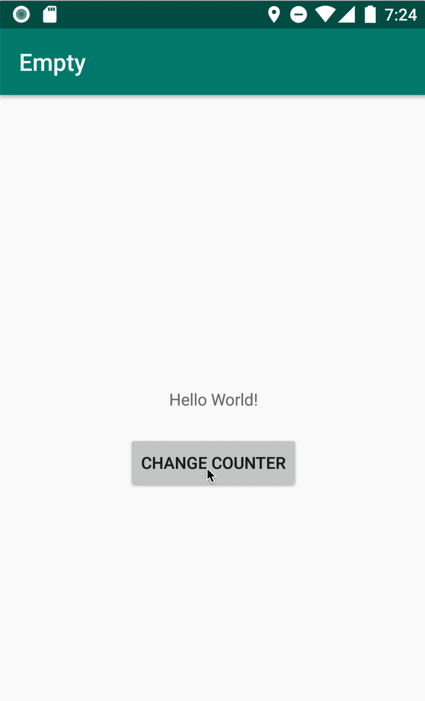
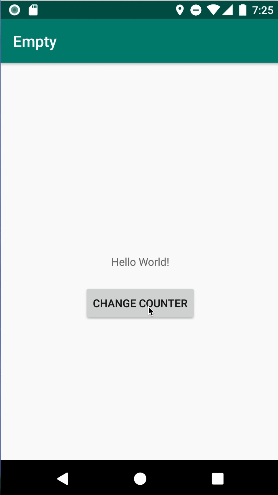
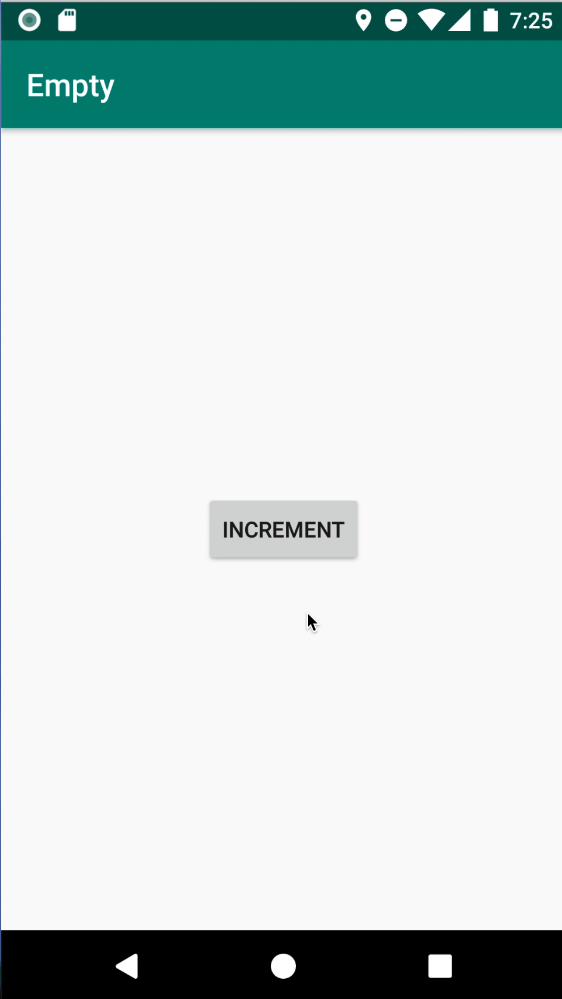

# livedata_vs_rx_navigation

This app tries to represent a case when 
a) business state is changed on a separate view
b) navigation needs to be handled on a _default_ screen

App shows differences in navigation handled using Livedata and RxJava's streams.
Whole showcase consist of 3 cases
1) [Case 1](https://github.com/mateuszkwiecinski/livedata_vs_rx_navigation/blob/master/app/src/main/java/pls/help/livedata/MainActivity.kt#L31) 
Navigation handled with `PublishSubject` and observed in onCreate:

2) [Case 2](https://github.com/mateuszkwiecinski/livedata_vs_rx_navigation/blob/master/app/src/main/java/pls/help/livedata/MainActivity.kt#L31) 
Navigation handled with `LiveData` and observed in onCreate:

3) [Case 3](https://github.com/mateuszkwiecinski/livedata_vs_rx_navigation/blob/master/app/src/main/java/pls/help/livedata/MainActivity.kt#L31) 
Navigation handled with `PublishSubject` and observed in onStart to simulate LiveData's behavior:

